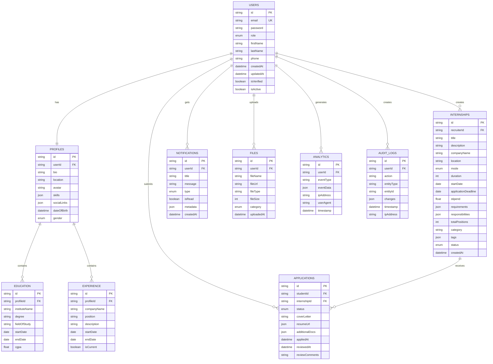
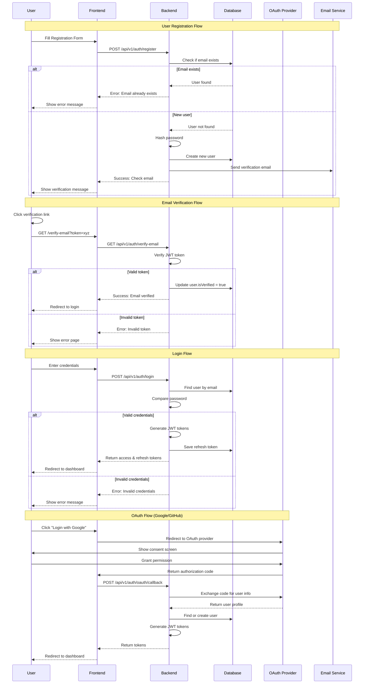
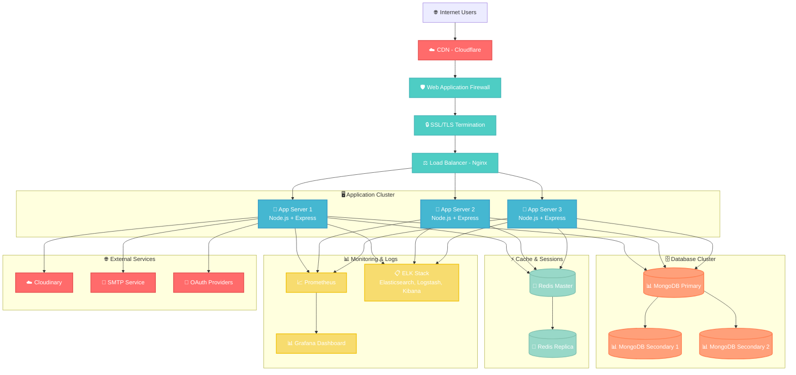
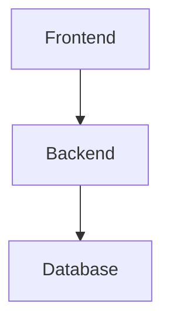

# 🎨 PM Internship Platform - Mermaid Diagrams

## 🏗️ **System Architecture Diagram**

```mermaid
graph TB
    %% Define styles
    classDef frontend fill:#3B82F6,stroke:#1E40AF,stroke-width:2px,color:#fff
    classDef backend fill:#10B981,stroke:#047857,stroke-width:2px,color:#fff
    classDef database fill:#F59E0B,stroke:#D97706,stroke-width:2px,color:#fff
    classDef external fill:#8B5CF6,stroke:#7C3AED,stroke-width:2px,color:#fff
    classDef user fill:#EF4444,stroke:#DC2626,stroke-width:2px,color:#fff

    %% Users
    Student[👨‍🎓 Student User]:::user
    Admin[👨‍💼 Admin User]:::user
    Recruiter[🏢 Recruiter User]:::user

    %% Frontend Layer
    subgraph Frontend["🖥️ Frontend Layer (React + Vite)"]
        StudentDash[📊 Student Dashboard]:::frontend
        AdminDash[⚙️ Admin Dashboard]:::frontend
        RecruiterDash[💼 Recruiter Dashboard]:::frontend
        AuthPages[🔐 Authentication Pages]:::frontend
        LandingPage[🏠 Landing Page]:::frontend
    end

    %% Backend Layer
    subgraph Backend["⚡ Backend Layer (Node.js + Express)"]
        AuthService[🔑 Authentication Service]:::backend
        UserAPI[👥 User Management API]:::backend
        InternshipAPI[💼 Internship API]:::backend
        ApplicationAPI[📝 Application API]:::backend
        FileAPI[📁 File Upload API]:::backend
        EmailAPI[📧 Email Service]:::backend
        AnalyticsAPI[📈 Analytics API]:::backend
    end

    %% Database Layer
    subgraph Database["🗄️ Database Layer (MongoDB + Prisma)"]
        UserDB[(👤 Users Collection)]:::database
        InternDB[(💼 Internships Collection)]:::database
        AppDB[(📝 Applications Collection)]:::database
        FileDB[(📁 Files Collection)]:::database
        AnalyticsDB[(📊 Analytics Collection)]:::database
        AuditDB[(📋 Audit Logs)]:::database
    end

    %% External Services
    subgraph External["🌐 External Services"]
        GoogleOAuth[🔍 Google OAuth]:::external
        GitHubOAuth[⚫ GitHub OAuth]:::external
        Cloudinary[☁️ Cloudinary Storage]:::external
        SMTP[📧 SMTP Email Service]:::external
        Redis[⚡ Redis Cache]:::external
        PaymentGW[💳 Payment Gateway]:::external
    end

    %% User Connections
    Student --> StudentDash
    Admin --> AdminDash
    Recruiter --> RecruiterDash
    Student --> AuthPages
    Admin --> AuthPages
    Recruiter --> AuthPages

    %% Frontend to Backend
    StudentDash --> UserAPI
    StudentDash --> InternshipAPI
    StudentDash --> ApplicationAPI
    StudentDash --> FileAPI
    
    AdminDash --> UserAPI
    AdminDash --> InternshipAPI
    AdminDash --> ApplicationAPI
    AdminDash --> AnalyticsAPI
    
    RecruiterDash --> InternshipAPI
    RecruiterDash --> ApplicationAPI
    RecruiterDash --> UserAPI
    
    AuthPages --> AuthService

    %% Backend to Database
    AuthService --> UserDB
    UserAPI --> UserDB
    InternshipAPI --> InternDB
    ApplicationAPI --> AppDB
    FileAPI --> FileDB
    EmailAPI --> AuditDB
    AnalyticsAPI --> AnalyticsDB

    %% Backend to External Services
    AuthService --> GoogleOAuth
    AuthService --> GitHubOAuth
    AuthService --> Redis
    FileAPI --> Cloudinary
    EmailAPI --> SMTP
    UserAPI --> Redis
    InternshipAPI --> PaymentGW
```



## 🎯 **User Journey Flow Diagram**

```mermaid
graph LR
    %% Define styles
    classDef start fill:#22C55E,stroke:#16A34A,stroke-width:2px,color:#fff
    classDef process fill:#3B82F6,stroke:#1E40AF,stroke-width:2px,color:#fff
    classDef decision fill:#F59E0B,stroke:#D97706,stroke-width:2px,color:#fff
    classDef end fill:#EF4444,stroke:#DC2626,stroke-width:2px,color:#fff

    %% Student Journey
    subgraph StudentFlow["👨‍🎓 Student User Journey"]
        S1[🚀 Start]:::start
        S2[📝 Registration]:::process
        S3[📧 Email Verification]:::process
        S4{✅ Verified?}:::decision
        S5[👤 Profile Setup]:::process
        S6[📊 Dashboard Access]:::process
        S7[🔍 Browse Internships]:::process
        S8[🎯 Apply to Internship]:::process
        S9[📈 Track Application]:::process
        S10[🎉 Success]:::end
    end

    %% Admin Journey
    subgraph AdminFlow["👨‍💼 Admin User Journey"]
        A1[🚀 Admin Login]:::start
        A2[⚙️ Admin Dashboard]:::process
        A3[👥 User Management]:::process
        A4[💼 Internship Oversight]:::process
        A5[📊 Analytics Review]:::process
        A6[📋 Generate Reports]:::process
        A7[🔧 System Config]:::process
        A8[✅ Task Complete]:::end
    end

    %% Recruiter Journey
    subgraph RecruiterFlow["🏢 Recruiter User Journey"]
        R1[🚀 Company Registration]:::start
        R2[✅ Verification]:::process
        R3[💼 Recruiter Dashboard]:::process
        R4[📝 Post New Internship]:::process
        R5[📋 Review Applications]:::process
        R6[🤝 Interview Process]:::process
        R7[🎯 Selection Process]:::process
        R8[🎉 Onboarding]:::end
    end

    %% Flow connections
    S1 --> S2 --> S3 --> S4
    S4 -->|Yes| S5 --> S6 --> S7 --> S8 --> S9 --> S10
    S4 -->|No| S3

    A1 --> A2 --> A3 --> A4 --> A5 --> A6 --> A7 --> A8

    R1 --> R2 --> R3 --> R4 --> R5 --> R6 --> R7 --> R8
```

## 📊 **Database Schema Diagram**



## 🔐 **Authentication Flow Diagram**



## 🚀 **Deployment Architecture Diagram**



## 💡 **How to Use These Mermaid Diagrams**

### **1. Online Mermaid Editor**
- Visit: https://mermaid.live/
- Copy any diagram code above
- Paste and see live preview
- Export as PNG/SVG

### **2. Install Mermaid CLI**
```bash
npm install -g @mermaid-js/mermaid-cli
```

### **3. Generate Images**
```bash
# Create diagram file
echo "graph TD; A-->B;" > diagram.mmd

# Generate PNG
mmdc -i diagram.mmd -o diagram.png

# Generate SVG  
mmdc -i diagram.mmd -o diagram.svg
```

### **4. GitHub Integration**
```markdown
<!-- In your README.md -->
## System Architecture


```

### **5. VS Code Extension**
Install "Mermaid Preview" extension to preview diagrams directly in VS Code.

## 🎨 **Customization Tips**

### **Colors**
```mermaid
classDef frontend fill:#3B82F6,stroke:#1E40AF,color:#fff
classDef backend fill:#10B981,stroke:#047857,color:#fff
```

### **Icons**
Use emojis in node labels:
- 🖥️ Frontend
- ⚡ Backend  
- 🗄️ Database
- 👤 Users
- 📊 Analytics

These Mermaid diagrams will generate professional, interactive diagrams that you can use in presentations, documentation, and GitHub repositories!
